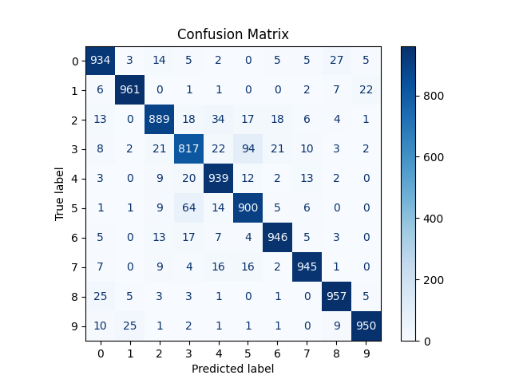
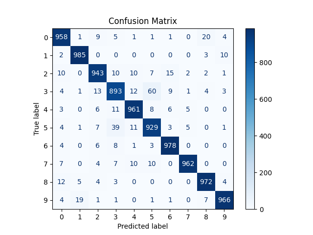
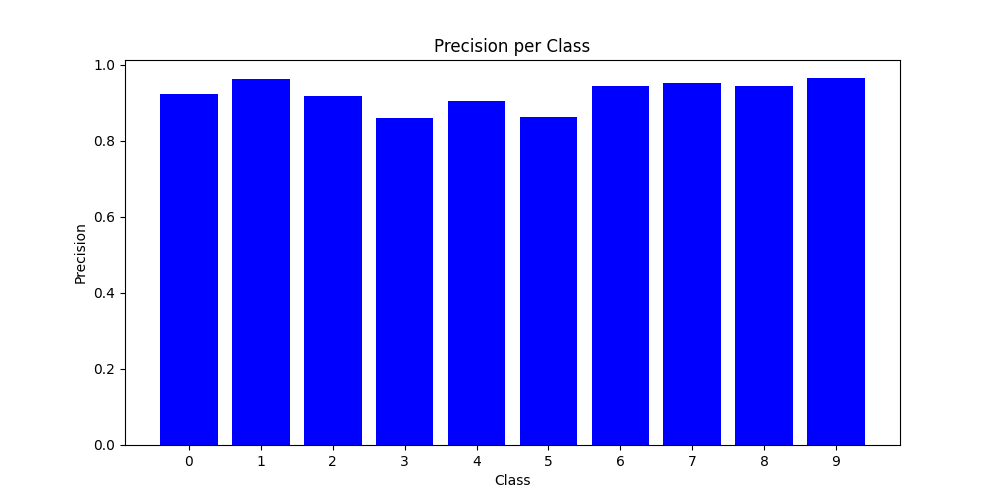
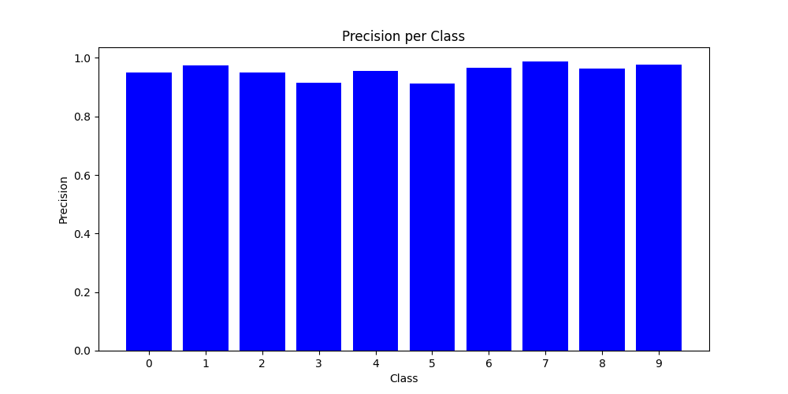
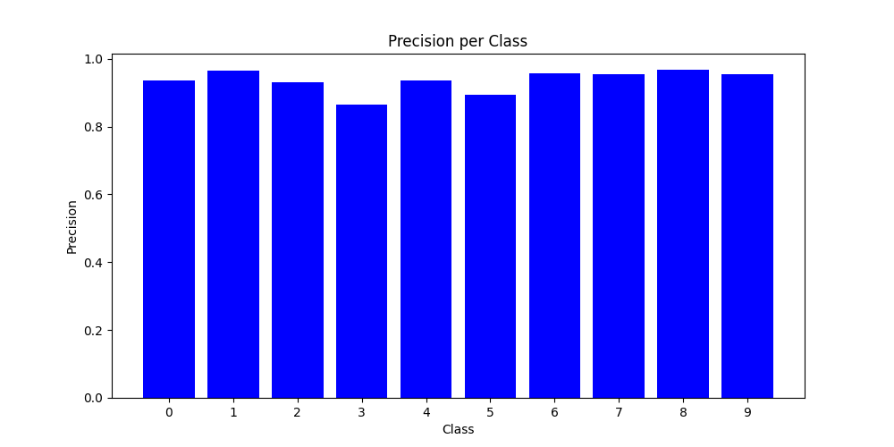
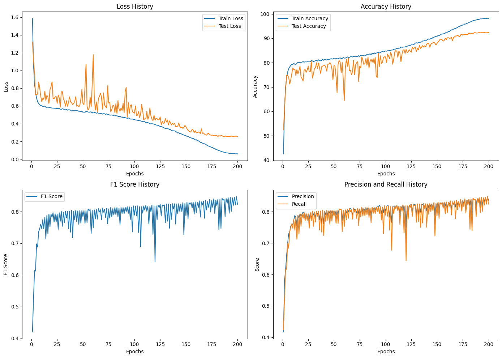
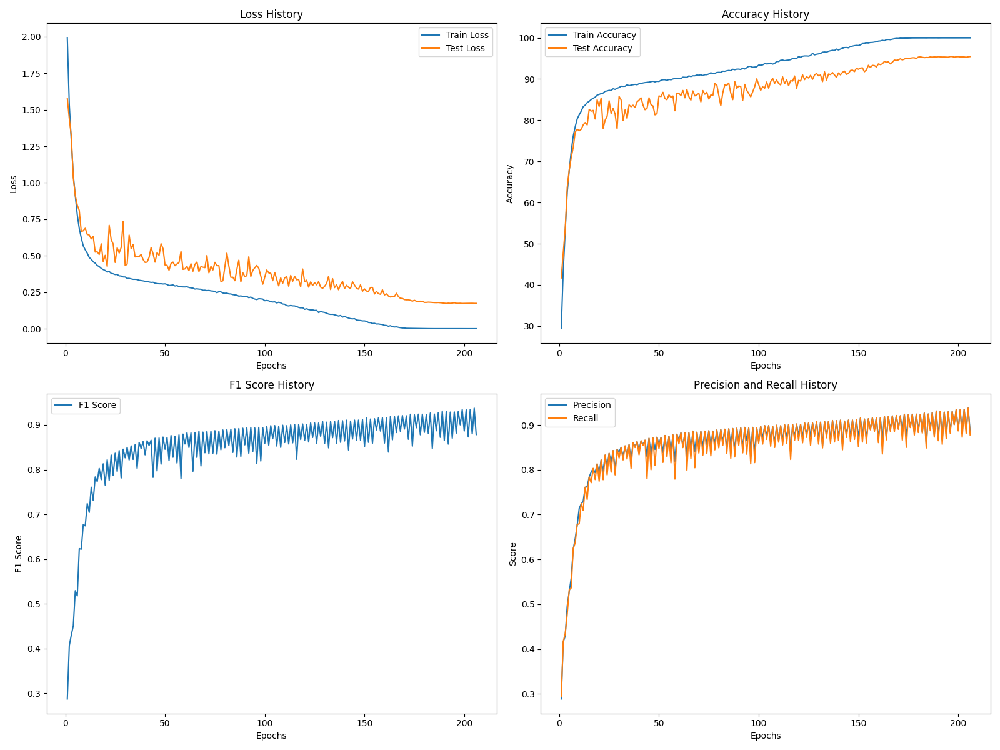
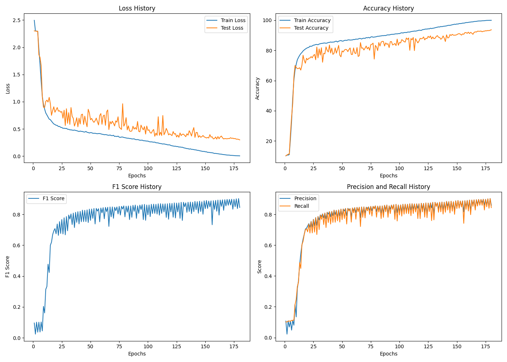

# **Comparative Analysis of Deep Learning Models for CIFAR-10 Classification**

## **Project Overview**
This project evaluates the performance of three well-known deep learning models—**MobileNetV2**, **ResNet18**, and **VGG19**—on the **CIFAR-10** dataset. The goal is to compare their accuracy, precision, recall, and F1-score across various image categories. Each model is trained for 200 epochs, and their performance is analyzed using metrics such as training loss, test accuracy, precision/recall, and confusion matrices.

---

## **Aim**
The aim of this project is to:
1. Compare the performance of MobileNetV2, ResNet18, and VGG19 on the CIFAR-10 dataset.
2. Identify strengths and weaknesses of each architecture when applied to image classification.
3. Evaluate each model's efficiency and generalization capabilities to understand their trade-offs in terms of accuracy and computational cost.

---

## **Index**
1. [Project Overview](#project-overview)
2. [Aim](#aim)
3. [How to Run the Code](#how-to-run-the-code)
4. [Model Architectures](#model-architectures)
   - Key Characteristics
   - Layer Composition
   - Effect on Performance
5. [Results](#results)
   - Confusion Matrices
   - Precision/Recall per Class
   - Loss and Accuracy Curves
   - F1 Score
6. [Comparison](#comparison)
7. [Conclusion](#conclusion)

---

## **How to Run the Code**

1. **Clone the Repository**:
   ```bash
   git clone https://github.com/your_username/comparative-analysis-cifar10.git
   cd comparative-analysis-cifar10
   ```

2. **Install Dependencies**:
   Install all the required dependencies listed in the `requirements.txt` file.
   ```bash
   pip install -r requirements.txt
   ```

3. **Train the Models**:
   To train the models, navigate to the corresponding directory for each model and run the script.

   **MobileNetV2**:
   ```bash
   cd MobileNetV2_CIFAR10
   python mobilenetv2_cifar10.py
   ```

   **ResNet18**:
   ```bash
   cd RESNET18_CIFAR10
   python resnet18_cifar101.py
   ```

   **VGG19**:
   ```bash
   cd VGG_CIFAR10
   python vgg_cifar10.py
   ```

4. **Visualize the Results**:
   The results (training curves, confusion matrices, precision, recall) are saved automatically in each model’s folder.

---

## **Model Architectures**

### **MobileNetV2**

#### Key Characteristics:
- **Depthwise Separable Convolutions**: Efficient, lightweight operations that drastically reduce computational cost, making MobileNetV2 ideal for mobile or embedded systems.
- **Inverted Residuals with Linear Bottlenecks**: Expands and compresses the feature maps to extract deep features while maintaining efficiency.

#### Layer Composition:
- Series of **3x3 depthwise convolutions** followed by **1x1 pointwise convolutions**.
- **ReLU6 activations** to prevent numerical instability.
- No **Dropout** is applied, keeping the network lightweight.

#### Effect on Performance:
- MobileNetV2 achieves **90.1% test accuracy** and performs well on structured classes like automobiles and ships. However, its lightweight nature causes it to struggle with complex categories like animals (e.g., cats and dogs).

---

### **ResNet18**

#### Key Characteristics:
- **Residual Connections**: Skip connections prevent vanishing gradients, allowing ResNet18 to train deeper layers effectively without losing accuracy.
- **Basic Blocks**: Stacks of two 3x3 convolutions followed by batch normalization and ReLU activations.

#### Layer Composition:
- **7x7 convolutional layer** followed by **max-pooling** and residual blocks.
- No **Dropout** is used, but residual blocks provide enough regularization.

#### Effect on Performance:
- ResNet18 demonstrates excellent **generalization** with **91.5% test accuracy**, outperforming MobileNetV2 and VGG19 on complex classes. Its F1 score of **0.91** indicates balanced precision and recall across all classes.

---

### **VGG19**

#### Key Characteristics:
- **Deep Convolutional Layers**: VGG19’s depth provides the capacity to learn detailed patterns, though it risks overfitting.
- **Fully Connected Layers**: Three fully connected layers increase the model’s complexity, making it prone to overfitting.

#### Layer Composition:
- **3x3 convolutions** followed by **max-pooling** layers, leading to fully connected layers for classification.
- **Dropout** is applied before the fully connected layers to reduce overfitting.

#### Effect on Performance:
- VGG19 achieves **88.3% test accuracy**, showing overfitting tendencies. Its performance lags behind the other models, especially in complex animal categories.

---

## **Results**

### **Confusion Matrices**

#### **MobileNetV2 Confusion Matrix**:  


#### **ResNet18 Confusion Matrix**:  


#### **VGG19 Confusion Matrix**:  


### **Precision and Recall per Class**

#### **MobileNetV2 Precision**:  


#### **ResNet18 Precision**:  


#### **VGG19 Precision**:  


### **Loss and Accuracy Curves**

#### **MobileNetV2 Training Plots**:  


#### **ResNet18 Training Plots**:  


#### **VGG19 Training Plots**:  


---

## **Comparison**

- **MobileNetV2** offers lightweight and efficient classification, performing well on structured classes, but struggles with more complex categories like animals.
- **ResNet18** shows the best overall performance, with the highest generalization and balanced precision/recall scores across all classes. Its residual connections enable deeper learning without sacrificing accuracy.
- **VGG19** is the deepest model but struggles with overfitting due to its complexity. While it achieves decent accuracy, it doesn’t generalize as well as the other two models, particularly for complex categories.

---

## **Conclusion**

- **MobileNetV2** is ideal for environments with limited computational resources, making it highly suitable for mobile or embedded applications.
- **ResNet18** provides the best balance between accuracy and generalization, making it the top choice for tasks that require reliable performance across a variety of categories.
- **VGG19** shows good performance but is prone to overfitting, especially in categories with complex visual patterns. It might be more suitable for tasks where depth and complexity are critical but with more regularization.

---

## **Recommendation**

You might want to add:
- **License Information**: Specify the project’s licensing.
- **Contribution Guidelines**: If this is a collaborative project, include `CONTRIBUTING.md` to explain how others can contribute.
- **Additional Visualizations**: If relevant, you can add more visualizations such as per-class performance over epochs.
